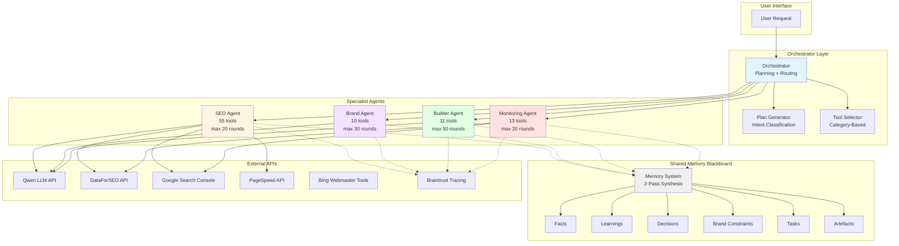
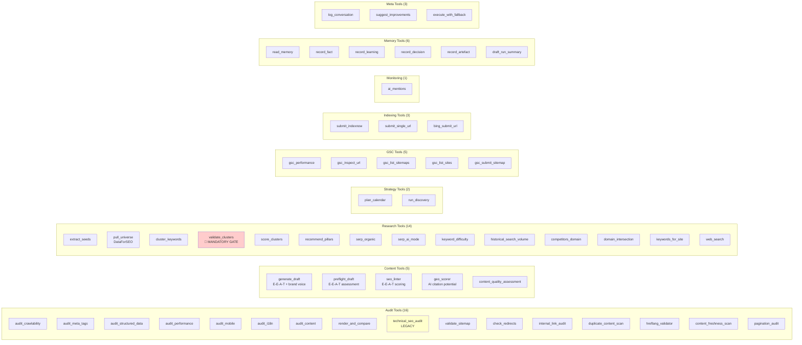
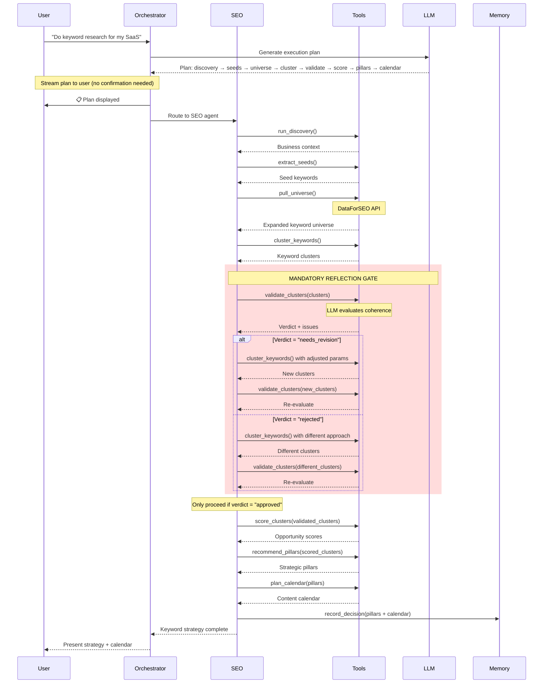
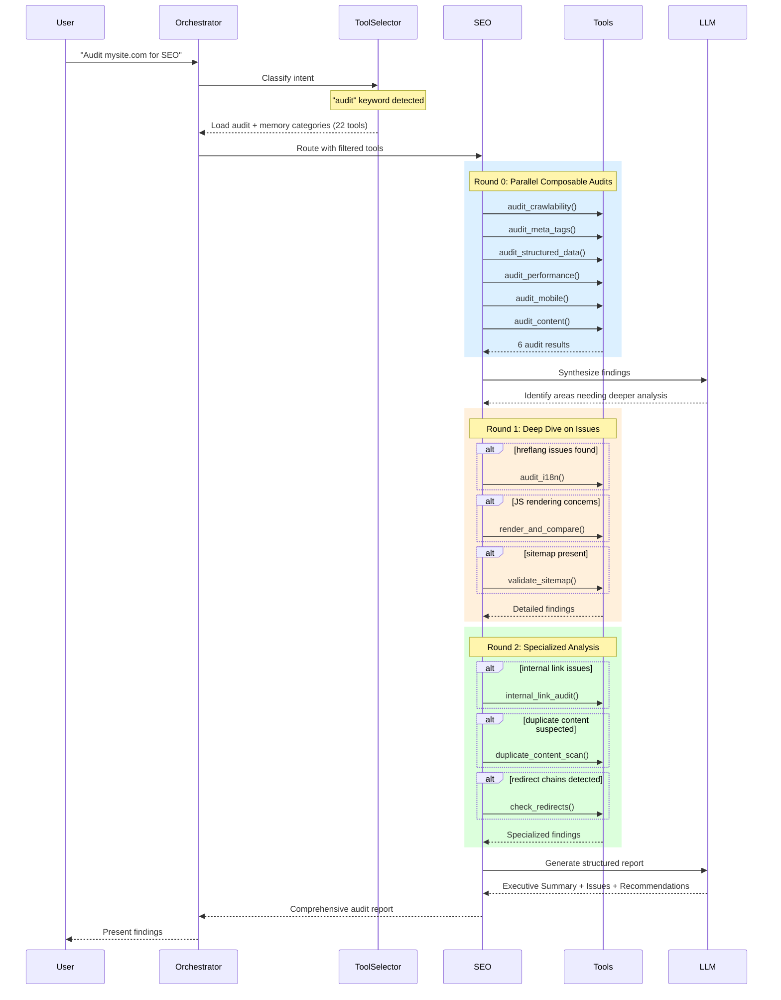
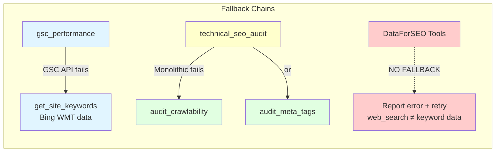
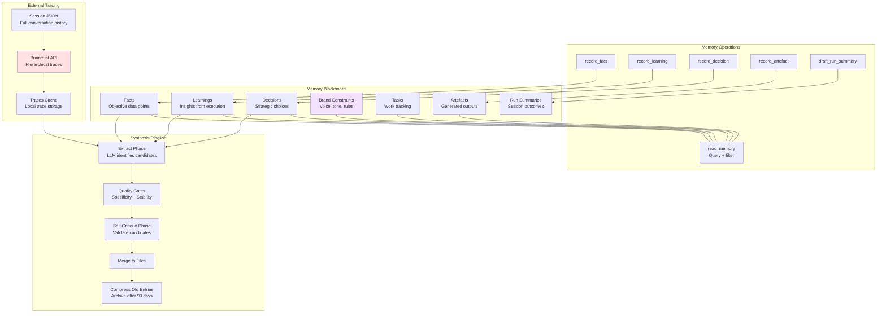
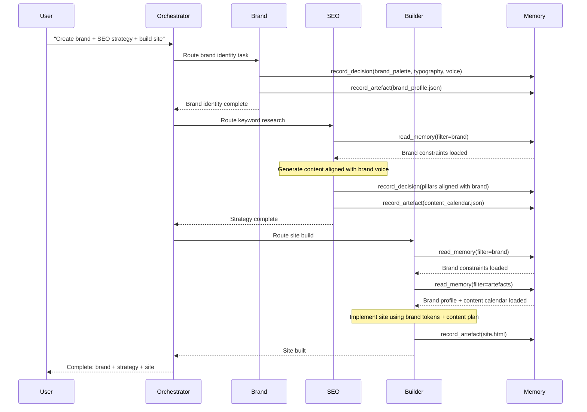
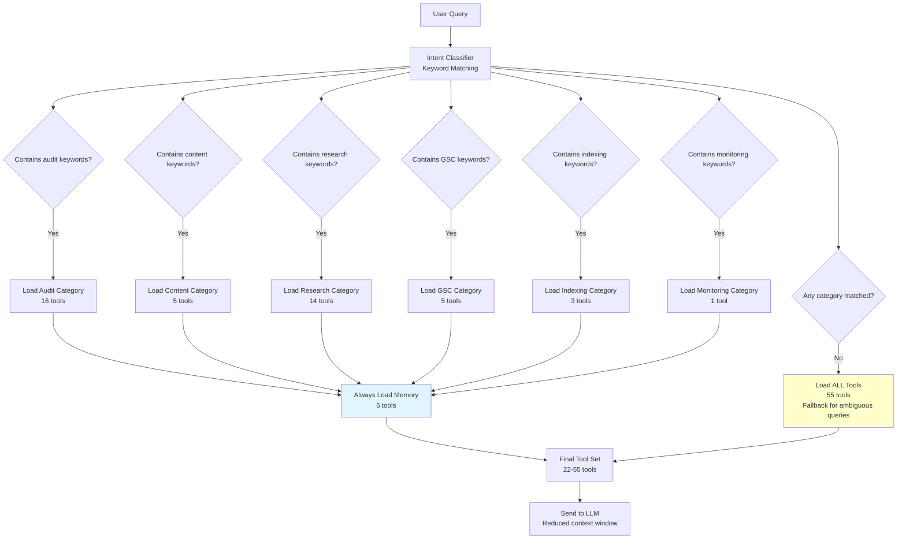
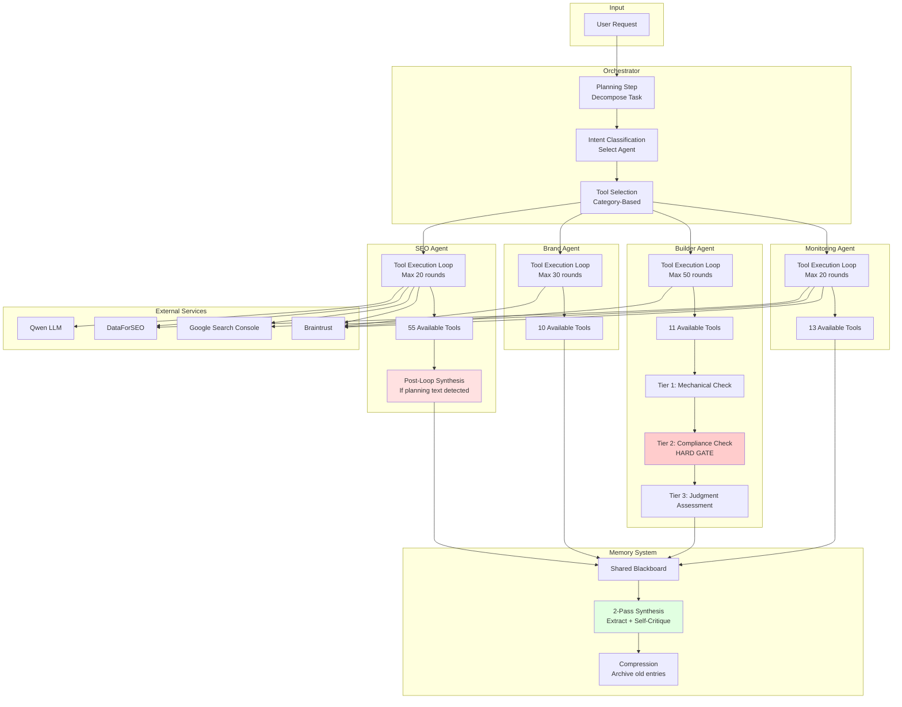

# SEO Agent System - Knowledge Graph

## 1. System Architecture Overview



---

## 2. SEO Agent Tool Categories



---

## 3. Keyword Research Workflow with Reflection Gate



---

## 4. Audit Workflow with Composable Tools



---

## 5. Fallback Chain Topology



---

## 6. Memory System Architecture



---

## 7. Agent Communication via Memory



---

## 8. Tool Selection Flow



---

## 9. Post-Loop Synthesis Flow

```mermaid
graph TB
    ToolLoop[Tool Execution Loop] --> CheckLast{Last message<br/>is planning text?}
    
    CheckLast -->|No| End[Session Complete<br/>Natural ending]
    CheckLast -->|Yes| Detect[Detect Planning Indicators<br/>"let me", "now let's", etc.]
    
    Detect --> HasFindings{Contains findings<br/>keywords?}
    
    HasFindings -->|Yes| End
    HasFindings -->|No| Synthesis[Post-Loop Synthesis]
    
    Synthesis --> Condense[Condense Messages<br/>Extract key findings from tool results]
    Condense --> Truncate[Truncate to Top 5 Issues Per Tool]
    Truncate --> BuildPrompt[Build Synthesis Prompt<br/>Structured report template]
    
    BuildPrompt --> LLMSynthesis[LLM Generate Report]
    
    LLMSynthesis --> Success{Success?}
    Success -->|Yes| AddReport[Add Report to Session]
    Success -->|No| Fallback[Fallback: Basic Summary<br/>From tool results]
    
    AddReport --> Save[Save Session]
    Fallback --> Save
    End --> Save
    
    style Synthesis fill:#ffe1e1
    style Condense fill:#e1ffe1
    style Fallback fill:#ffffcc
```

---

## 10. Complete System Data Flow



---

## Legend

- **Blue nodes**: Core system components
- **Green nodes**: Successful operations / tools
- **Yellow nodes**: Legacy / fallback / warnings
- **Red nodes**: Critical gates / error handling
- **Purple nodes**: Brand-related components
- **Gray nodes**: Memory / storage

---

## Key Insights from Knowledge Graph

1. **Tool Selection Optimization**: Category-based selection reduces context from 55 to 22-27 tools for specific intents, improving LLM performance and reducing costs.

2. **Reflection Pattern**: The validate_clusters tool acts as a mandatory gate in the keyword research workflow, preventing "hallucinated strategy" from incoherent clusters.

3. **Composable vs Legacy**: The audit suite split provides 8 specialized tools that can be chained, while the legacy technical_seo_audit remains for backward compatibility.

4. **Memory as Communication Layer**: Agents don't communicate directly - they read/write to the shared blackboard, creating a decoupled architecture.

5. **Fallback Chains Limited**: Only non-data tools have fallbacks. DataForSEO tools have NO fallbacks because web_search cannot provide equivalent keyword/SERP data.

6. **Post-Loop Synthesis**: Detects when the agent stops with planning text and forces generation of a structured final report, preventing incomplete outputs.

7. **Parallel Tool Execution**: Multiple tools can be called in parallel within a single round, improving efficiency for independent operations.

8. **Planning Without Confirmation**: The orchestrator generates and displays a plan for transparency, but doesn't block execution on user confirmation (per research findings).

---

*Generated: 2026-07-28*  
*System Version: SEO Agent v2.0 (Post-Google Research + Andrew Ng Patterns Implementation)*
