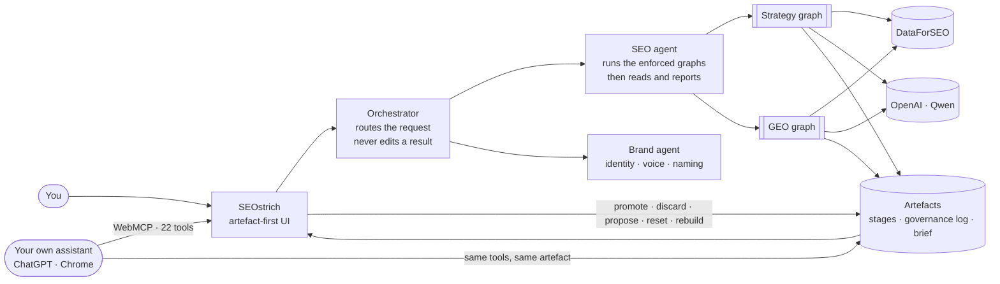
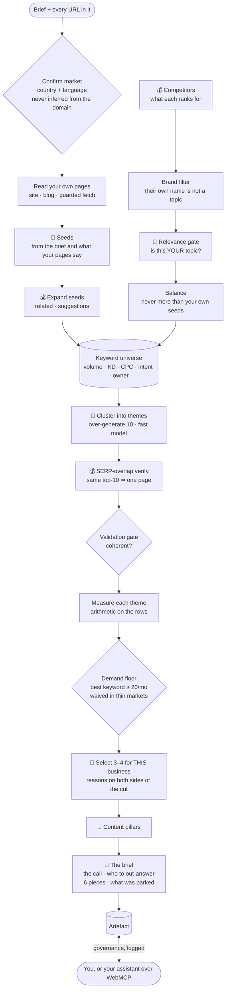
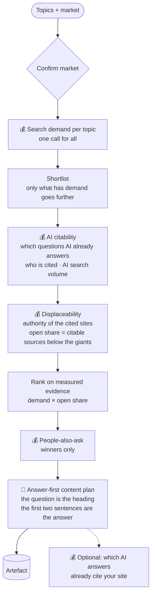

# How SEOstrich works — the three graphs

Every step below is code, not a prompt: the order and the gates are fixed, every
node records its output as a stage on the artefact, and the only thing a model
decides is wording and grouping. Paid DataForSEO calls are marked 💰; model
calls are marked 🤖; everything else is arithmetic.

## 1. The system

The orchestrator only routes. The SEO agent runs a graph and reports on it; after
a graph returns, the tools that change the selection are removed from its turn.
Changing the selection is the person's job — in the UI or through their own
assistant over WebMCP — and every change is logged with who and why.

## 2. The strategy graph (`run_keyword_strategy`)

## 3. The GEO graph (`run_geo_demand`)

